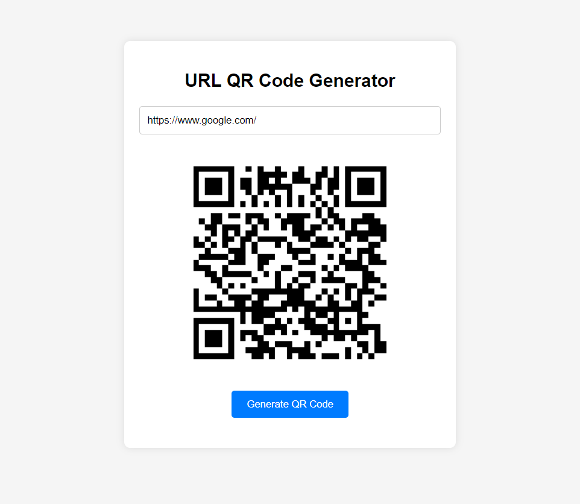

<p align="center">
<a href="https://github.com/0xelsherif/URL-QR-Code-Generator"></a>
<a href="https://github.com/0xelsherif/URL-QR-Code-Generator"></a>
<a href="https://github.com/0xelsherif/URL-QR-Code-Generator"></a>
<a href="https://github.com/0xelsherif/URL-QR-Code-Generator/discussions"></a>
<a href="https://github.com/0xelsherif/URL-QR-Code-Generator/issues"></a>
<a href="https://codepen.io/0xelsherif/full/poBrEPJ" target="_blank"></a>
<!-- <a href="https://0xelsherif.medium.com/mastering-text-analysis-with-javascript-a-step-by-step-guide-f9914fb5b5f1" target="_blank"></a> -->
</p>


# URL QR Code Generator
This project provides a straightforward way for users to generate QR codes for URLs. By simply entering the desired URL and clicking a button, users can quickly obtain a QR code representation of the URL. The application validates the input URL format and dynamically generates the QR code using JavaScript and the QRCode.js library.

## Usage

1. Enter the URL you want to generate a QR code for in the input field.
2. Click the "Generate QR Code" button.
3. The QR code will be displayed below the input field.

## Features

- Validates input URL format.
- Generates QR code dynamically based on user input.

## Technologies Used

- HTML
- CSS
- JavaScript
- QRCode.js (a library for generating QR codes)

## How to Run

### Option 1: Download ZIP

1. Download the ZIP file from the [GitHub repository](https://github.com/0xelsherif/URL-QR-Code-Generator).
2. Extract the ZIP file to your desired location.
3. Open the extracted folder.
4. Double-click the `index.html` file to open it in a web browser.

### Option 2: Clone the Repository

1. Clone the repository using the following command in your terminal or command prompt:
``` 
git clone https://github.com/0xelsherif/URL-QR-Code-Generator.git 
```
2. Navigate to the cloned directory:
``` 
cd URL-QR-Code-Generator
```
3. Open the `index.html` file in a web browser.

## Allowed Input

- Valid URLs starting with 'ftp://', 'http://', or 'https://'
- URLs must not contain spaces or special characters.

### Examples

- Valid: https://www.example.com
- Valid: http://subdomain.example.com/page
- Valid: ftp://ftp.example.com
- Invalid: www.example.com (missing protocol)
- Invalid: http://www example com (contains spaces)
- Invalid: https://www.example.com/page with space (contains space)

## Preview



## Support and Contributions

If you find this project useful or interesting, consider giving it a star ⭐ on GitHub and spreading the word! Your support means a lot to me and helps in maintaining and improving the project.

If you'd like to contribute to the project, whether it's fixing bugs, adding new features, or improving documentation, feel free to open a pull request. Contributions of all kinds are welcome!

## Follow Me

Follow me on GitHub to stay updated with my latest projects and contributions:


[](https://github.com/0xelsherif)
<a href="https://twitter.com/intent/follow?screen_name=0xelsherif"></a>
[](https://www.linkedin.com/in/0xelsherif)
[](https://medium.com/@0xelsherif)
[](https://codepen.io/0xelsherif)


### Buy Me a Coffee ☕

If you'd like to support the development of this project further or express your appreciation with a small gesture, consider buying me a coffee! Your support helps keep me fueled for more coding sessions. Thank you for your support! 

[](https://www.buymeacoffee.com/0xelsherif)
